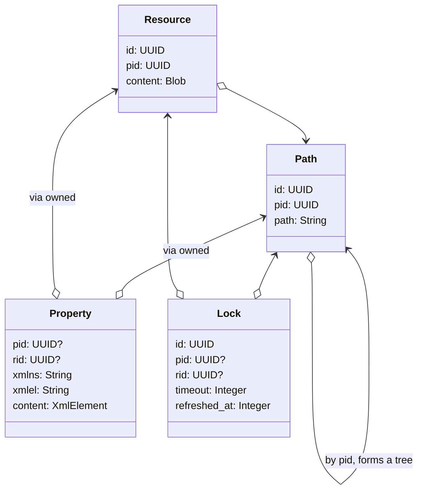

# GroupWare

A `*DAV` server, supporting:

- [x] WebDAV against a sqlite db
  - [x] core RFCs (resources, properties, locks)
  - [ ] ACLs & Users
- [ ] CalDAV
- [ ] CardDAV

# Relevant RFCs

- [x] [RFC 2518 - WebDAV (old)](http://www.webdav.org/specs/rfc2518.html)
- [x] [RFC 4918 - WebDAV (newer)](http://www.webdav.org/specs/rfc4918.html)
- [ ] [RFC 3474 - WebDAV ACLs](http://www.webdav.org/specs/rfc3744.html)
- [ ] [RFC 4791 - CalDAV over WebDAV](https://datatracker.ietf.org/doc/html/rfc4791)
- [ ] [RFC 6352 - CardDAV over WebDAV](https://datatracker.ietf.org/doc/html/rfc6352)

I do _not_ plan on supporting any of:
- [RFC 3253 - WebDAV Versioning](http://www.webdav.org/specs/rfc3253.html) not planning on supporting

# Running

* see `.env.development` for configuration
* run migrations: `bundle exec ./bin/migrate`

## `bin/server`

Starts a rackup server, and serves `Dav::Router`

* the router looks up paths in the `Repos::Paths` repository, and then forwards to the path's _controller_
* a path's _controller_ is inherited down the path tree, and allows different "types" of DAV collections
  * eg. address books and calendars
  * currently, only `collection` controller exists
* a _controller_ class exposes the HTTP methods it handles

See:
* [router.rb](./mod/dav/router.rb)
* [collection.rb](./mod/dav/controllers/collection.rb)

## `bin/console`

Starts an IRB console, with the system finalized.

`main#get` is a shortcut for `System::Container.[]`, eg:

```ruby
paths = get("dav.repos.paths")
paths.at_path("/testpath")
```

## `bin/sqlite`, `bin/migrate`

Because we use a customized database connection, we can't use the built-in
`sequel` CLI for migrations, or the `sqlite3` cli for running SQL.

These tools run migrations and a database console in the context of the
customized connection.

In these tools, the following SQL functions are available:

* `uuid()`
* `escape_url()`
* `unescape_url()`

# Domain

Not actually, but mostly:

* `paths` stores the tree of pathnames
  * nodes in the path tree can have `resources`, which are the actual data contents
  * nodes in the path tree may also have `properties`, which are xml-based kv pairs

* `resources` store the actual data contents of the tree
  * separate from the tree so that different controllers can store data differently
  * may have `properties` and `locks`
  * on creation, automatically creates a handful of properties
    * `etag`, `content-length`, `creationdate`, etc.

* `locks` may be placed on paths or resources
  * deep locks affect children recursively
  * shared locks may be shared, but exclusive may not be



# Method of Operation

`System::Container` is a dependency injection root for the whole system, built
on top of the excellent [dry-system](https://dry-rb.org/gems/dry-system) gem.

An application starts by calling `System::Container.finalize!`, which auto-registers
components in the `mod` directory, making them available via the container.

## Providers

The container automatically starts and manages the lifecycle of components in the
`config/providers` directory, such as the database connection and logger.

These are _not_ auto-registered however; rather providers hook lifecycle events, and
can do whatever, including registering services.

## Auto-registered components

Files in the `mod` directory can be auto-loaded by requesting them from the container
by name, which is the path, but with dots, eg. `dav.controllers.collection`.

These components will, by default, _not_ be memoized between invocations, returning a
new instance each time it's resolved; see `config/system.rb` to customize particular
components.

## Constructor Auto-injection

A component can `include System::Import["some.component"]`; this will override the
`.new` and `#initialize` methods to accept `component:`, and pull from the container
if not present.

# Registered Keyspace

```ruby
irb(console):001> System::Container.keys
=> [
  "settings",         # dry-settings, see `config/providers/settings`
  "logger",           # ouigai logger, see `config/providers/logger`
  "db.connection",    # sequel database, see `config/providers/database`

  "dav.repos.paths",  # data access for resources/paths
  "dav.router",       # rack application * controllers
  "dav.controllers.collection"

  # TODO:
  # "dav.controllers.addressbook"
  # "dav.controllers.calendar"
]
```

# Example

```ruby
# in ./bin/console, #get pulls from the container
paths  = get("dav.repos.paths") # from mod/dav/repos/paths.rb
logger = get("logger") # ouigai logger

# then just use them
res = paths.at_path("/hello")
logger.info("something", res:)
```

```ruby
# in mod/dav/new_component.rb
module Dav
  class NewComponent
    include System::Import["db.connection"]

    def do_something
      connection
    end
  end
end

nc = Dav::NewComponent.new                   # will use the container
nc = Dav::NewComponent.new(connection: mock) # will _not_ use the container
```

# Integration Tests

Currently, we're testing against the [WebDAV.org Litmus Compliance Suite](http://www.webdav.org/neon/litmus/).

1. download the source code [litmus-0.13.tar.gz](http://www.webdav.org/neon/litmus)
1. extract it somewhere
1. run `./configure`
1. run `make URL="http://localhost:5000" check` to run tests

# License

Copyright 2023 Jon Raphaelson, Accidental.cc LLC\
This is proprietary, for the time being.
